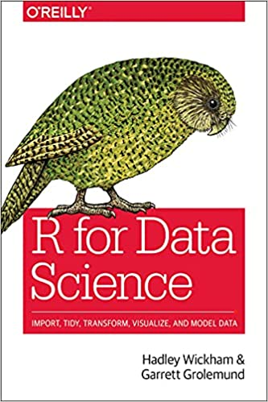
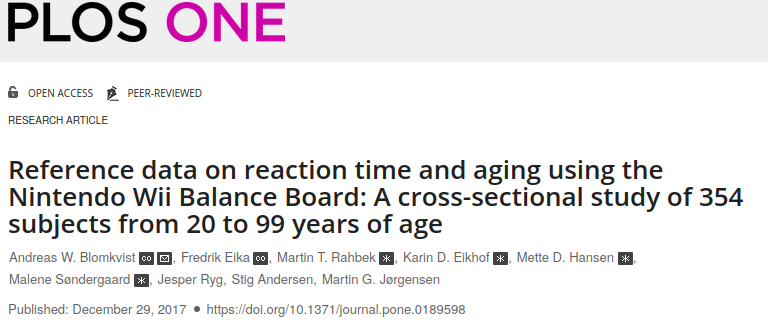

```{=html}
<style>

slides > slide.backdrop {
  background: white;
}

.gdbar img {
  width: 240px !important;
  height: 54px !important;
  margin: 8px 8px;
  position: absolute;
}

.gdbar {
  width: 350px !important;
  height: 70px !important;
}

slides > slide:not(.nobackground):before {
  width: 128px;
  height: 33px;
  background-size: 100px 30px;
}

.smalltable .table{
  font-size: 18px;
}

pre {
  font-size: 15px;
}
</style>
```


```{r setup, include=FALSE}
knitr::opts_chunk$set(echo = TRUE, warning = FALSE, eval = TRUE, message = FALSE, comment=NA)
options("kableExtra.html.bsTable" = T, digits = 2)
options(pillar.print_min = 5, pillar.print_max = 6)
library(tidyverse)
library(knitr)
library(kableExtra)
```

## About me: Jens Roeser 

<div style="float: left; width: 65%;">

- early career researchfellow @ psychology department (Nottingham Trent University)
- theory: psycholinguistics; language production / comprehension / acquisition [e.g. @roeser2019advance]
- methods: Bayesian modelling [talk to me about mixture models, @roeser2021modelling] in Stan; keystroke logging; eyetracking
- teaching: statistics -- R of course [`psyntur`, @psyntur]; cognitive psychology; language acquisition
- twitter: <https://twitter.com/jens_roeser>

</div>

<div style="float: right; width: 30%;">

```{r fig.align='right', out.width="100%", echo = F}
knitr::include_graphics("../gfx/me.jpg")
```
</div>


## Outline

- Data viz with `ggplot2`
- Data wrangling with `tidyverse`
- Lots of hands-on exercises


## Why should I care?

Why using R (or code in general) to handle data?

*What do you think?*

## Why should I care?

Why using R (or code in general) to handle data?

- \> 70% to 80% of data analysis is data wrangling
- Open source: R is and always will be free
- Large community of friendly peer support
- Reproducibility: publish your code and look at code of other researchers
- Flexibility: different ways of looking at data
- Quickly growing number of available add-ons 
- Faster than manual data processing 
- Processing of **large** data sets
- Reduce manual work
- Reduce human error

## Rules!

- Never change your data manually; document everything in code.
  - Retrospective amendments made easy
  - Documentation / reproducibility
- Organized working environment
  - `.Rproj` with one director per project with sub-directories for scripts, data, plots, etc
  - Short scripts: less code with one clear purpose is always better (test is: does the name of your script suggest a specific or general purpose?)
- Comment your code (`# Ceci n'est pas un comment!`)
- If possible, use `tidyverse` instead of base R.


## Recommended reading 

<div style="float: left; width: 40%;">

- *R for Data Science* by Wickham and Grolemund
- This link [r4ds.had.co.nz/](https://r4ds.had.co.nz/)

</div>
<div style="float: left; width: 55%;">

```{r fig.align='right', out.width="55%", echo = F}

```

</div>

## Download repository

- Download: [https://github.com/jensroes/ljm-r-workshop](https://github.com/jensroes/ljm-r-workshop)
- Click on: `Code` \> `Download ZIP` \> unzip directory on your machine.
- Open project by double clicking on `ljm-r-workshop.Rproj`
- `viz/exercises/`: exercises associated with each topic
- `data/`: scripts read data from here
- `viz/slides.Rmd`: these slides in R markdown format (`.html` format provided as well)


## Example data set: @blomkvist2017reference 

```{r fig.align='center', out.width="80%", echo = F}

```

- Age-related changes in cognitive performance through adolescence and adulthood in a real-world task.

## Real-world task: StarCraft 2

<div style="float: left; width: 45%;">

```{r fig.align='left', out.width="80%", echo = F}
knitr::include_graphics("../gfx/sc2b.jpeg")
```

- Real-time strategy video game
- Nintendo Wii Balance Board

</div>

<div style="float: right; width: 45%;">

```{r fig.align='right', out.width="80%", echo = F}
knitr::include_graphics("../gfx/sc2.jpeg")
```

```{r fig.align='right', out.width="80%", echo = F}
knitr::include_graphics("../gfx/sc2c.jpeg")
```

</div>


## Example data set: @blomkvist2017reference 

<div style="float: left; width: 50%;">

```{r eval = F}
blomkvist <- read_csv("../data/blomkvist.csv")
glimpse(blomkvist)
```
```{r echo = F}
blomkvist <- read_csv("../data/blomkvist.csv")
glimpse(blomkvist, width = 60)
```
</div>

<div style="float: right; width: 45%;">

- Average reaction time (`rt`) of dominant (`_d`) or non-dominant (`_nd`) `hand` or `foot` in msecs
- `medicine`: number of drugs used daily

</div>


## References


